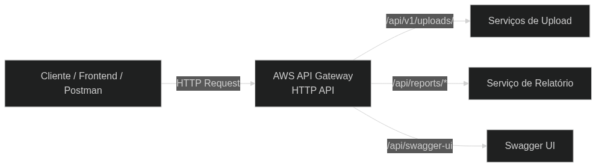

# 📦 API Gateway Service (Entrypoint)

Este repositório gerencia o **AWS API Gateway (HTTP API)**, que atua como o ponto de entrada único do sistema, roteando o tráfego entre diferentes destinos conforme o path da requisição.

---

## 🌐 Arquitetura de Roteamento

O API Gateway centraliza o tráfego e distribui as requisições da seguinte forma:

- **Rotas de Upload (`/v1/upload/{proxy+}`):** Encaminha as requisições para o **Serviço de Upload** no EKS, onde residem os serviços da Mecânica.
- **Rotas de Relatório (`/api/reports/{proxy+}`):** Direcionadas para o **Microserviço de Relatório** no EKS.
- **Rota de Documentação:** Mapeamento específico para o **Swagger UI** e definições OpenAPI.

---

## 🧭 Diagrama da Arquitetura

---

### 🔗 Endpoints de Acesso (Exemplos)
A URL base do Gateway é gerada dinamicamente e pode ser consultada através dos **outputs do Terraform** após o deploy.

| URL Base do Gateway                                    | Caminho do Swagger |
|:-------------------------------------------------------| :--- |
| `https://{api-id}.execute-api.us-east-2.amazonaws.com` | `/api/swagger-ui/index.html` |

---

## ⚙️ Isolamento por Ambiente

Para permitir que os ambientes coexistam na mesma conta AWS sem conflitos, a infraestrutura via Terraform utiliza:

- **Nomenclatura Dinâmica:** Todos os recursos (API, Stages, Integrations) possuem o sufixo `${var.environment}` (ex: `main-http-api-homologation`).
- **Segurança:** As permissões são restritas via Security Groups e IAM Roles, garantindo que o Gateway acesse apenas os recursos do ambiente correspondente.
- **URLs Independentes:** Cada deploy gera um endpoint específico, isolando o tráfego de teste do tráfego de produção.

---

## 🛡️ Regras do Repositório (Desafio)

- **Branch main:** Protegida contra commits diretos. Uso obrigatório de Pull Requests.
- **Fluxo de Trabalho:** O merge deve seguir a ordem sugerida: `develop` -> `homologation` -> `main`.
- **Deploy Automático:** O deploy via GitHub Actions é disparado automaticamente para as branches de **homologation** e **main**.

---

## 🔁 CI/CD

O deploy da infraestrutura é realizado automaticamente via **GitHub Actions**
nas branches `homologation` e `main`.

🔗 Pipeline: https://github.com/architecture-ai-analyzer/gateway/actions

---

## 🚀 Operações (Terraform)

### Planejamento da Infraestrutura Local
1. `cd infra/terraform`
2. `terraform init -backend-config="key=api-gateway/${var.environment}/terraform.tfstate"`
3. `terraform plan -var="environment=homologation"`
4. `terraform apply -var="environment=homologation"`

---

## 🧪 Testes de API (Postman)

Este repositório disponibiliza uma **Postman Collection** contendo
os principais fluxos da aplicação da oficina mecânica.

📁 Local: `docs/postman/oficina-api.postman_collection_fase_4.json`

## 🧪 Monitoramento
- **Métricas:** Latência, contagem de requisições e erros (4xx/5xx) monitorados via **CloudWatch Metrics**.
- **Logs:** Logs de acesso detalhados configurados por Stage, permitindo auditoria de quem acessou qual endpoint.
- **Saúde do Backend:** Integração direta com o **Health Check (/actuator/health)** das instâncias no EKS.

---

## 🧰 Tecnologias Utilizadas
- AWS API Gateway (HTTP API)
- Amazon EKS
- Terraform
- GitHub Actions
- Swagger

---

> ⚠️ **Observação:**  
> Os ambientes não permanecem ativos continuamente para evitar custos em AWS.
> A URL do API Gateway é disponibilizada como **outputs do Terraform**
> após o deploy do ambiente.
> Ajuste a variável `AWS_URL` conforme o output do Terraform.
